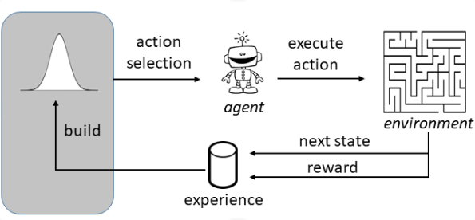
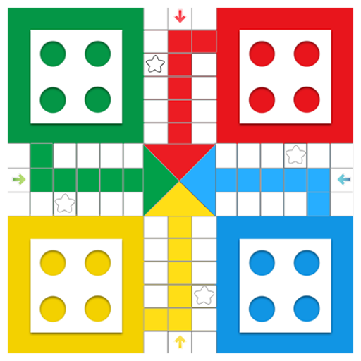

## Introduction 

The Ludo game, known for its blend of luck and strategy, served as the
foundation for this project. The project aims to develop an artificial
intelligence (AI) agent capable of playing the classic board game Ludo
through the application of reinforcement learning techniques,
particularly Q-learning. Ludo, a game of strategy and chance, involves
moving tokens around the board based on dice rolls, with the goal of
reaching the center before opponents. 


## Installation
Before running the game, ensure you have the required libraries installed:
``` bash 
pip install pygame torch
```

***P.S : Stable Version in src folder, numbered are ongoing experiments***

## Game Setup
- Pygame Library: Used for game development including rendering the game window and managing events.
- Assets: Game assets (images and sounds) must be placed in the same directory as the game script.
- Neural Network for AI Players
- QNetwork Class: A neural network with two fully connected layers, using ReLU activation for the hidden layer.
- AI Players: Four separate instances for each AI player, each with its own neural network.

## Running the Game
To start the game, run the main Python script:
``` bash
python ludo_game.py
```

Players can choose between AI-only and mixed human-AI gameplay (from terminal for now, Until We make some GUI for that 🙏

## Team
- Mehran Wahid
- Abdullah Saim - [Github](https://github.com/ASa1m)
- Areeba Tanveer - [Github](https://github.com/areeba-tanveer).
- Onkar - [Github](https://github.com/onkarrai06) 

## Game Play 

-   Ludo involves racing tokens around the board to reach the center.

-   Each player has four tokens of a distinct color.

-   Tokens start in a designated home area and must travel around the
    board.

-   The primary goal is to move all tokens from the starting area to the
    center.

-   Tokens move based on dice rolls, and the first player to get all
    tokens home wins.

-   Safe zones provide protection for tokens from being captured by
    opponents.

-   Capturing occurs when a token lands on a space occupied by an
    opponent\'s token, sending the opponent\'s token back to its home
    area.

-   Dice rolls introduce chance, but strategic decisions include which
    token to move based on the current board position and potential
    future moves.

-   Players can block opponents by clustering tokens together,
    preventing them from making progress.

-   Defensive play involves protecting tokens by positioning them
    strategically within safe zones.

-   Players can adopt aggressive strategies by aiming to capture
    opponent tokens, risking their own tokens in the process.

-   Calculated risk-taking involves choosing between safe moves and
    riskier but potentially rewarding actions.

-   As tokens approach the home stretch, decision-making becomes
    crucial, maximizing dice rolls to precisely enter the

##  Reinforcement Learning

In our Ludo AI project, reinforcement learning (RL) is incorporated to
enable the AI agent to learn how to play the game effectively by
interacting with the environment, receiving feedback in the form of
rewards, and optimizing its strategy over time.



Figure

### State Representation

-   In our Ludo project, states represent the current board
    configuration, including token positions, safe zones, and opponent
    tokens.

-   Current Player: An integer representing the current player\'s index
    (0 for red, 1 for green, 2 for yellow, 3 for blue).

-   Dice Number: The number obtained from rolling the dice, ranging from
    1 to 6.

-   Token Positions: A nested list representing the positions of all
    tokens on the board. Each player has four tokens, and each token\'s
    position is a pair of coordinates (x, y) on the game board.

### Actions:

In this Ludo game, actions correspond to the movement of a player\'s
tokens based on the dice roll. There are four possible actions, one for
each token a player can move. The specific action taken depends on
several factors:

-   Dice Roll: The number rolled on the dice influences which tokens can
    be moved.

-   Token Position: Whether a token is in the home, on the board, or on
    the way to the winner\'s rank.

-   Game Rules: Certain rules, like needing a six to move a token out of
    home or only being able to move tokens within the board\'s paths,
    constrain possible actions

### Rewards

-   The reward system in the game is designed to encourage certain
    > behaviors that align with successful Ludo gameplay:

-   100 Points: Awarded for getting all tokens to the winner rank
    > (highest reward).

-   50 Points: Given for getting one token to the winner rank.

-   25 Points: For getting a token on the way to the winner path.

-   20 Points: Awarded for killing (sending back to home) an opponent\'s
    > token.

-   10 Points: For getting a token to a safe position.

-   5 Points: For getting a token out of home.

-   1 Point: For moving a token forward (lowest reward).

-   Negative Reward:

-   -10 Points: For invalid actions, such as selecting a token that
    > can\'t move based on the dice roll or the board position.

### Transformations

-   The q-networks require simple 1-dimensional.

    So, the state space needs preprocessing to reduce its dimensionality
    to be processed by q-network.

## Learning 

Project showcases automation via reinforcement learning, where AI agents
independently learn and refine strategies, making decisions based on
evolving game states and a reward system, exemplifying AI\'s capability
in automating complex gameplay and decision-making. A learning rate of
0.001 in the Ludo project played a crucial role in balancing the
adaptation of the agent\'s strategies.

## Greedy Startegy

Incorporating a greedy strategy with an epsilon value of 0.1 in the Ludo
project offered a more conservative approach in balancing exploration
and exploitation. With an epsilon of 0.1, the agent mostly exploited
known high-reward actions based on learned Q-values. However, there was
still a 10% chance for exploration, allowing the AI to occasionally opt
for random actions. This controlled exploration facilitated ongoing
discovery of potential improvements or alternative strategies while
predominantly favoring learned optimal actions. The epsilon-greedy
method with a value of 0.1 struck a balance between leveraging learned
knowledge and sporadically exploring new options, ensuring steady
learning and the potential for enhanced decision-making as the AI
progressed.

## Architecture

The neural network utilized in the Q-learning model consists of two
fully connected layers:

-   *Input Layer:* The input layer accepts the state space of the game.
    > In this case, it seems to have an input size of 32.

-   *Hidden Layer (fc1):* This layer has 64 neurons and uses the
    > Rectified Linear Unit (ReLU) activation function. ReLU helps
    > introduce non-linearity into the model and allows it to learn
    > complex patterns in the data.

-   *Output Layer (fc2):* The output layer has the number of neurons
    > equal to the number of possible actions in the game (denoted as
    > NUM_ACTIONS). It directly outputs the Q-values for each action in
    > a given state. Interface

{width="3.376388888888889in"
height="3.376388888888889in"}

Figure

## Conclusion

This project combines Pygame and reinforcement learning to introduce AI
into Ludo, showcasing strategic decision-making through a well-designed
reward system. The implementation highlights the adaptability and
learning capabilities of AI agents in gaming scenarios.

## Acknowledgment 

We express our deepest gratitude to my professor, Dr. Imran Malik whose
guidance and support were invaluable throughout this endeavor.

## References

1.  **\"A Survey of Deep Reinforcement Learning in Video Games\"** -
    State Key Laboratory of Management and Control for Complex Systems,
    Institute. [Link](https://ar5iv.labs.arxiv.org/html/1912.10944)

2.  **" Deep Reinforcement Learning: An Overview " --** Cornell
    University. [Link](https://arxiv.org/abs/1701.07274)

3.  **\"Human-level Reinforcement Learning Performance of Recurrent
    Neural Networks is Linked to Hyperperseveration, Not Directed
    Exploration\" --** Cold Spring Harbor Laboratory.
    [Link](https://www.biorxiv.org/content/10.1101/2023.04.27.538570v3)
